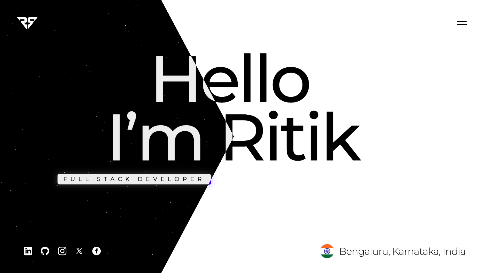
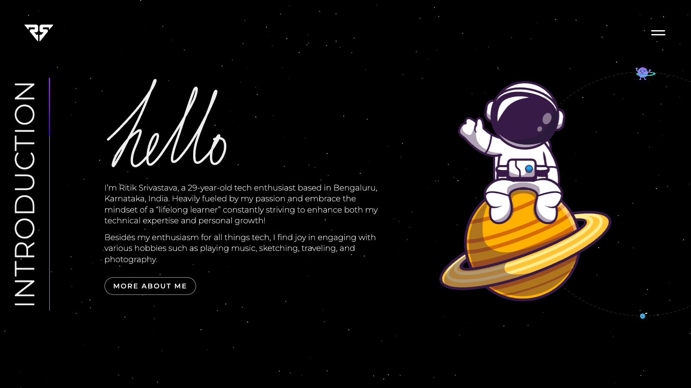
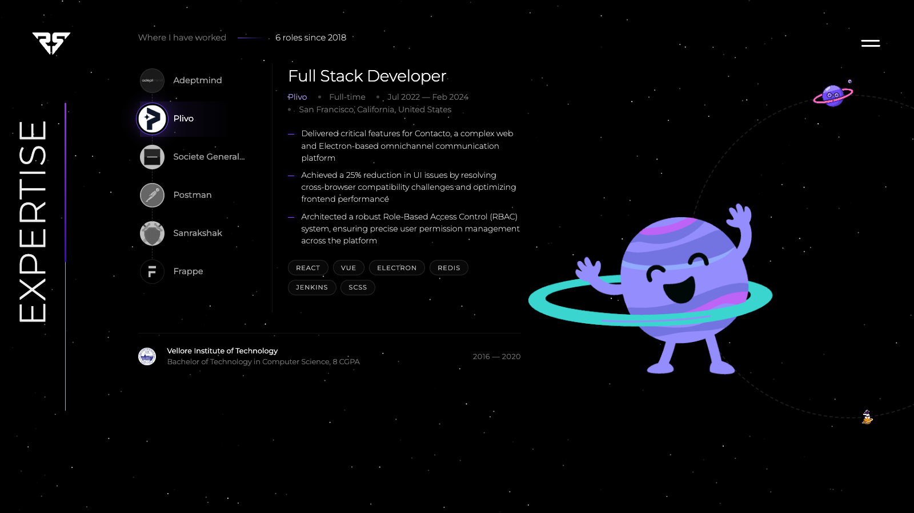
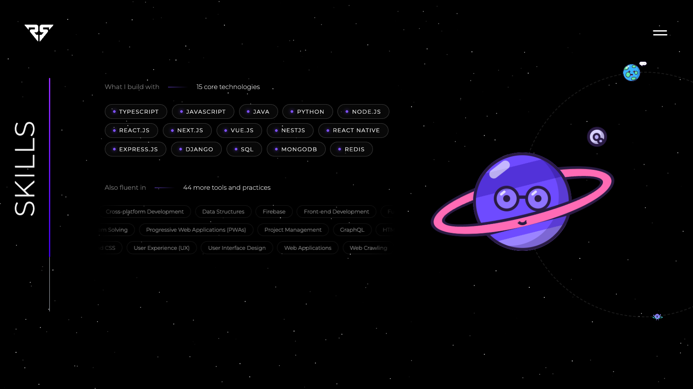
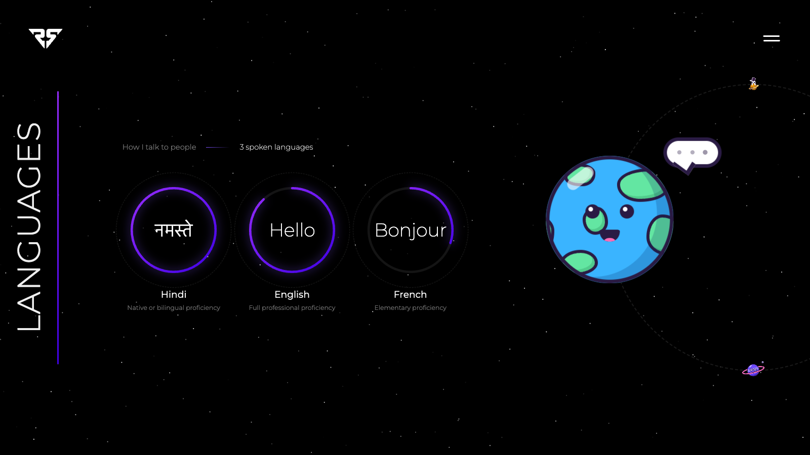

<div align="center">

# PortfolioSpace

A single-page personal portfolio driven entirely by scroll position. A chevron wipe transitions
the landing from light to dark, and profile sections travel an orbit as the page advances.

[Live site](https://itzzritik.github.io/PortfolioSpace/) ·
[Architecture](#architecture) ·
[Getting started](#getting-started) ·
[Configuration](#configuration)

[](https://github.com/itzzritik/PortfolioSpace/actions/workflows/deploy.yml)


</div>



## Overview

PortfolioSpace is a portfolio built as one continuous scene rather than a stack of sections. The
landing is composited from two identical DOM trees with inverted palettes; scroll position clips
one of them, producing a hard transition that keeps all text selectable and crisp at any zoom
level. Below it, four profile sections share a sticky orbital navigation whose active state is
derived from geometry rather than stored in component state.

All content (name, biography, roles, education, skills and languages) is fetched at runtime from
a profile API. The repository contains the presentation engine; the data lives elsewhere and can
change without a deployment.

The application compiles to static files and is served from GitHub Pages. There is no server
runtime and no animation dependency.

## Features

- **Scroll-composited landing.** Two DOM layers, one clip path. Text remains real text:
  selectable, zoomable, indexable.
- **Derived header state.** The logo and menu invert by evaluating the wipe boundary at their own
  position, sharing one function with the landing animation.
- **Orbital navigation.** Section progress maps to an orbit angle; per-planet scale falls off with
  angular distance from the focus.
- **Perspective starfield.** A 1,000-star canvas field on `requestAnimationFrame`, with a velocity
  other components can raise on interaction.
- **Runtime content.** A typed `IUserData` contract, fetched on mount and distributed through
  React context.
- **Static delivery.** `output: "export"` to GitHub Pages via GitHub Actions.

## Screens

<table>
<tr>
<td width="50%"></td>
<td width="50%"></td>
</tr>
<tr>
<td width="50%"></td>
<td width="50%"></td>
</tr>
</table>

## Architecture

### Rendering model

The landing renders `Hero` and `Minor` twice. The overlay layer is clipped to a five-point polygon
whose left edge tracks scroll progress; the asymmetric offsets produce the chevron rather than a
straight boundary.

```ts
// src/components/plugins/animations/home/scrollAnimation/landingAnim.ts
`polygon(100% 0, 100% 100%, ${i - 20}% 100%, ${i - 5}% 50%, ${i - 20}% 0)`
```

The same boundary is exposed as `wipeEdge(overlayIndex, yFraction)` and imported by the header
animation, which uses it to decide whether an element currently sits on the dark side. Changing the
wipe shape updates both call sites.

### Animation layer

Animations are imperative and run outside React. A single scroll and resize listener drives three
functions (landing, header and profile) while the starfield runs on its own `requestAnimationFrame`
loop. React owns the tree; the animation layer addresses it through enum-typed DOM ids
([`ReactID.ts`](src/data/constants/ReactID.ts)) rather than string literals.

Orbit positions are computed as a function of scroll:

```ts
// src/components/plugins/animations/home/scrollAnimation/profileAnim.ts
const scale = Math.max(scaleMin, 1 - Math.abs(totalAngle - midAngle) / diffAngleScale);
planet.style.setProperty(
  "transform",
  `rotate(-${totalAngle}deg) translate(${radius}px) rotate(${totalAngle}deg) scale(${scale})`,
);
```

Progress is accumulated in section-heights, so sections of differing height contribute correctly
and no per-section measurement is cached.

### Data layer

```
GET https://ritik.me/api/profile
        │
        ▼
GlobalContextProvider          pending → Splash holds
        │                      error   → UnderConstruction
        ▼
UserDataProvider (React context)
        │
        ▼
Hero · Introduction · Expertise · Skills · Languages
```

Every section is a pure function of the payload. The contract is
[`IUserData`](src/data/types/userData.d.ts).

## Getting started

**Prerequisites:** [Bun](https://bun.sh) 1.3 or later.

```bash
git clone git@github.com:itzzritik/PortfolioSpace.git
cd PortfolioSpace
bun install
bun dev
```

The development server runs on [localhost:4040](http://localhost:4040).

| Script | Description |
|---|---|
| `bun dev` | Development server on port 4040 |
| `bun run build` | Static export into `out/` |
| `bun start` | Serve the production build |
| `bun run lint` | Biome check |
| `bun run format` | Biome write |
| `bun run clean` | Reinstall dependencies from scratch |

## Configuration

**Data source.** Change the endpoint in
[`src/data/context/index.tsx`](src/data/context/index.tsx). Any response satisfying `IUserData` is
valid, including a static `profile.json` served from `public/`.

```ts
const response = await fetch("https://your-domain.com/api/profile");
```

**Theme.** Colours, gradients, easing curves and layout constants are declared in a single block at
the top of [`globals.scss`](src/app/globals.scss). Typography scales from one fluid root value,
`clamp(14px, 10px + 0.35vw, 24px)`, with all other sizes in `rem`.

**Sections.** Add a component exporting both a view and a `Planet`, then register it in
[`Profile.ts`](src/data/constants/Profile.ts). Orbit spacing (`360 / sections.length`), scroll
normalisation and the progress bar adjust automatically.

## Deployment

Pushes to `main` trigger [`deploy.yml`](.github/workflows/deploy.yml), which builds with Bun and
publishes `out/` to GitHub Pages. Under GitHub Actions, `basePath` is set to the repository name so
project pages resolve correctly; set it to `""` when serving from a custom domain.

## Project structure

```
src/
├─ app/                          layout, page, global styles
├─ components/
│  ├─ backgrounds/StarField/     canvas element
│  ├─ button/                    Button, Social, Hamburger
│  ├─ layouts/                   Splash, Navigation, Scroller, Birthday
│  ├─ page/home/
│  │  ├─ LandingSection/         Hero and Minor, rendered as base and overlay
│  │  └─ ProfileSection/         orbital navigation and the four sections
│  └─ plugins/animations/home/   starfield and scroll animations
├─ data/
│  ├─ constants/                 section registry, DOM id enums
│  ├─ context/                   profile fetch and context provider
│  └─ types/                     IUserData contract
├─ styles/_media.scss            breakpoints
└─ utils/                        useInView, date maths, font loading
```

## Responsiveness and motion

Three breakpoints are defined in [`_media.scss`](src/styles/_media.scss). At 1280px the orbit
rotates a quarter turn and the active planet becomes a sticky header the content scrolls beneath;
at 700px the layout collapses to a single column; a 480px height breakpoint handles landscape
phones, where vertical space is the constraint.

The auto-advancing Expertise rail is disabled under `prefers-reduced-motion: reduce`. Section
reveals are driven by `IntersectionObserver` and replay on re-entry.

## Roadmap

- Navigation routes: about, experience, projects, resume
- Projects section
- Downloadable CV route
- Keyboard and screen reader support for the orbital navigation

## Usage

The source is available to read and fork. The name, logo and profile content belong to the author
and should be replaced before deployment.

---

<div align="center">
<sub><a href="https://ritik.me">ritik.me</a> · <a href="https://linkedin.com/in/itzzritik">LinkedIn</a> · <a href="https://github.com/itzzritik">GitHub</a></sub>
</div>
